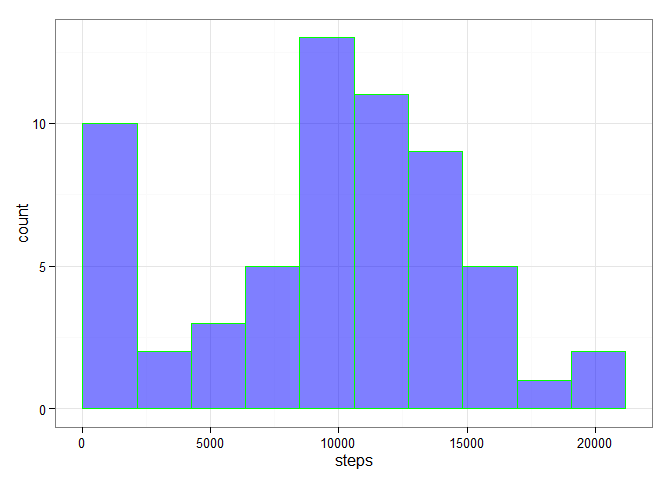
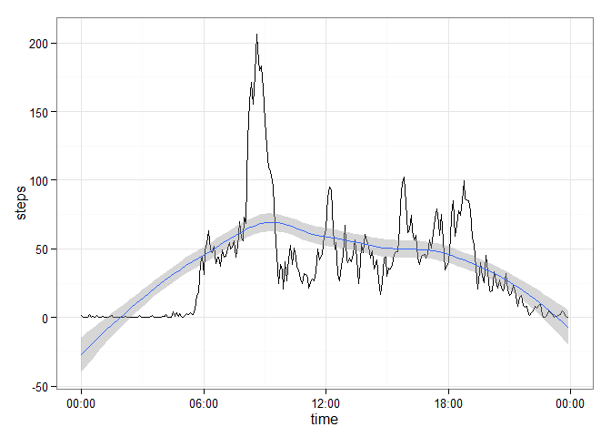
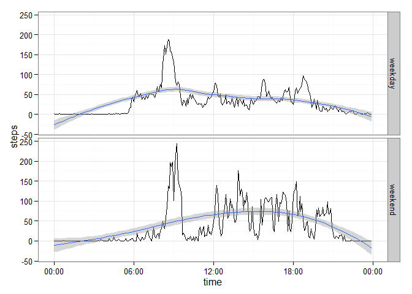

# Reproducible Research: Peer Assessment 1


## Loading and preprocessing the data

we will use some libraries

```r
library(ggplot2)
library(dplyr)
library(scales)
```

loading dataset

```r
unzip("activity.zip")
activity <- read.csv("activity.csv", 
                     colClasses = c("integer", "Date", "integer"))
```
we convert our "time interval" to unified representation where all times are times of 10th of December 1815

```r
timeInterval <- function(int) {
    hours <- int %/% 100
    minutes <- int %% 100
    ISOdatetime(1815,12,10,hours, minutes, 0 , tz = "")
    }
    
activity <- activity %>% mutate(time = timeInterval(interval))
head(activity$time)
```

```
## [1] "1815-12-10 00:00:00 LMT" "1815-12-10 00:05:00 LMT"
## [3] "1815-12-10 00:10:00 LMT" "1815-12-10 00:15:00 LMT"
## [5] "1815-12-10 00:20:00 LMT" "1815-12-10 00:25:00 LMT"
```


## What is mean total number of steps taken per day
Lets summarize steps by `date` variable

```r
daily.steps <- activity %>% 
    group_by(date) %>% 
    summarize(steps = sum(steps, na.rm = TRUE))
steps.breaks <- with(daily.steps, seq(min(steps), max(steps), length.out = 11))
ggplot(data = daily.steps, aes(steps)) + theme_bw() + 
    geom_histogram(breaks = steps.breaks , col = "green" , fill = "blue" , alpha = .5, binwidth = 0.1 )
```

 

```r
steps.summary <- summary(daily.steps$steps)
steps.summary
```

```
##    Min. 1st Qu.  Median    Mean 3rd Qu.    Max. 
##       0    6778   10400    9354   12810   21190
```
As we can see steps count by day have mean 9354 and median 10400


## What is the average daily activity pattern?
Now we'll calculate average steps for each day interval

```r
steps.by.interval <- activity %>% 
    group_by(time) %>% 
    summarize(steps = mean(steps, na.rm = TRUE))
```
and visualize it

```r
qplot(time, steps, data = steps.by.interval , geom = c("line", "smooth")) + 
    scale_x_datetime( labels = date_format("%H:%M", tz = "")) +
    theme_bw()
```

 

let's find the interval with maximum steps

```r
max.steps <- steps.by.interval %>% filter(steps == max(steps))
format(max.steps$time, "%H:%M")
```

```
## [1] "08:35"
```
So it's interesting that maximum steps are occuring from  08:35 to 08:40  
Looks like morning is the most active time

## Imputing missing values
Let's find out where and how much we have `NA`s!

```r
colSums(is.na(activity))
```

```
##    steps     date interval     time 
##     2304        0        0        0
```
So we have 2304 in the `steps` columns and other values are complete.

Let's replace those missing `steps` with time-wise median

```r
complete.activity <- activity %>%
    group_by(time) %>%
    mutate(steps = ifelse(is.na(steps), median(steps, na.rm = TRUE), steps))
```
Let's do another total step calculation for refilled dataset

```r
daily.steps.complete <- complete.activity %>% 
    group_by(date) %>% 
    summarize(steps = sum(steps, na.rm = TRUE))
ggplot(data = daily.steps, aes(steps)) + theme_bw() + 
    geom_histogram(breaks = steps.breaks , col = "green" , fill = "blue" , alpha = .5, binwidth = 0.1 )
```

 

Let's compare this with original results

```r
steps.summary <- function(df, name) df$steps %>% summary %>% unclass %>% t %>% as.data.frame(row.names = name)
rbind(
    steps.summary(daily.steps,          "original"),
    steps.summary(daily.steps.complete, "filled")
)
```

```
##          Min. 1st Qu. Median Mean 3rd Qu.  Max.
## original    0    6778  10400 9354   12810 21190
## filled     41    6778  10400 9504   12810 21190
```
So characteristics are barely changed, only minimum and mean did grow little bit


## Are there differences in activity patterns between weekdays and weekends?
Let's introduce new factor variable indicating whether day is weeked or not
Instead of the `weekdays` function we use more locale-stable way

```r
activity.wday <- complete.activity %>%
    mutate(wday = as.factor(ifelse(as.POSIXlt(date)$wday > 5, "weekend", "weekday")))
summary(activity.wday$wday)
```

```
## weekday weekend 
##   15264    2304
```
Finally calculating average steps by interval depending on weekend indicator:

```r
steps.by.int.wday <- activity.wday %>% 
    group_by(time, wday) %>% 
    summarize(steps = mean(steps, na.rm = TRUE))
```
And visualizing it

```r
qplot(time, steps, data = steps.by.int.wday , geom = c("line","smooth"), facets = wday ~ .) + 
    scale_x_datetime( labels = date_format("%H:%M", tz = "")) +
    theme_bw()
```

 

So weekends are definitely involves more walking than ordinary weekday.

